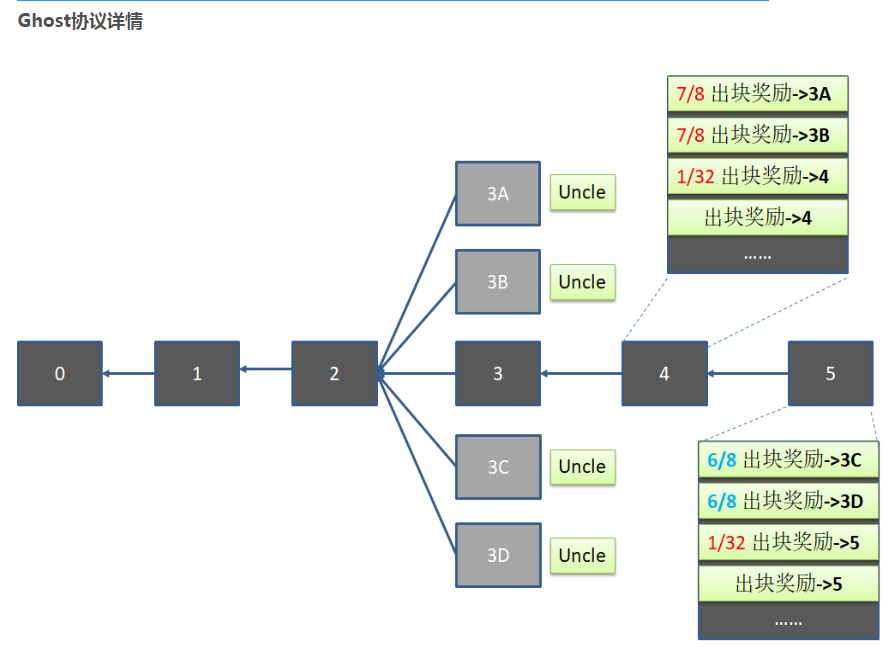
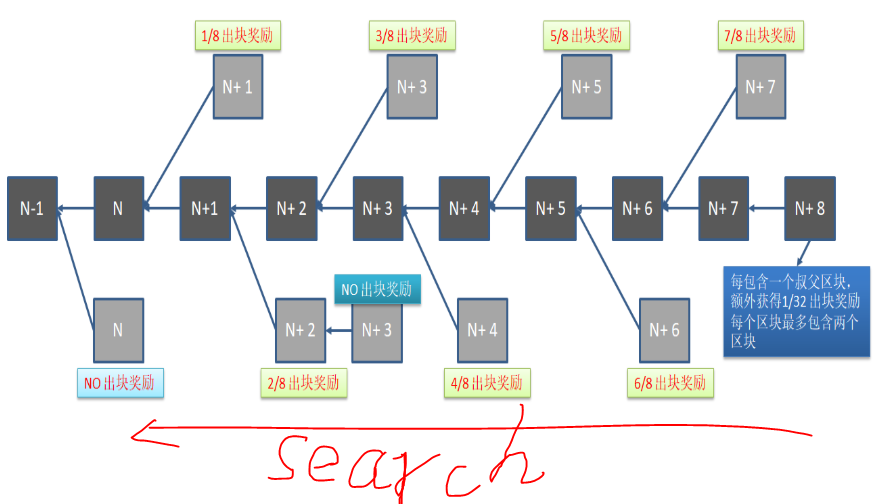

在15秒的时间内，一个新发布的区块很很大可能还没有扩散到整个区块链网络。  
在这种情况下，如何达到比特币中的共识协议，如何才能更好的遵守“链长为王”——最长的链会被认为主链呢？  
 因为以太坊极大提升了出块时间，这引起的一个明显的问题就是频繁的区块链分叉问题，在15秒内很大可能有多个节点同时挖出一个区块，  
 这些节点到底谁挖出的区块才能成为主链呢？ 如果继续沿用比特币中的区块奖励方法，假如几乎在同时有多个矿工挖出了一个区块，此时网络中占据较大算力的矿池其算力巨大，而且通常地理位置优越，其网络与更多的节点相连，  
 它发布的区块能跟更快的在网络中传播，因此在出现区块链分叉时，其所在的分叉更有可能成为主链。这种情况下，其他算力较低的矿池或者个体节点就不能得到出块奖励，在以太坊中经常发生区块链分叉的情况，但最后区块链的出块奖励大部分情况下都被大型矿池拿走，而算力小的节点通常很少拿到奖励，这种情况叫做“Centralization Bias”。 如果以太坊沿用比特币中的出块奖励方式，算力较小的矿池几乎拿不到出块奖励，这个看起来不太公平，长此以往，算力小的矿工挖出区块之后就不愿意合并到算力强的矿工挖出的区块链中，因为合并就意味着前面的劳动全部白费了，还不如不要合并，继续在自己挖出的区块上继续挖矿，说不定运气好能超过算力强的区块呢。很明显，这样下去不利于区块链出现分叉后快速合并，会影响到区块链的共识，基于上述原因，以太坊的设计中引入了Ghost协议。  
  
在以太坊中区块分叉是一个司空见惯的情况，因此区块链发生分叉之后尽快合并以维护区块链的统一显得尤为重要。在上图中，假设一个大型矿池A打包了一个黑色的3号区块，并将3号区块flooding发送出去，告知其他矿工3号区块已经被A挖掘出来了。以太坊中的出快时间是15秒，在15秒内这个3号区块并没有完全扩散到整个区块链网络中，因此其他没有收到这个区块的节点会继续挖掘3号区块。发布了3号区块之后A继续挖4号区块，在此过程中A陆续收到了其他节点挖出的3号区块的通知，上图中假设A收到了来自其他四个节点发布的3号区块（上图中灰色表示，分别是3A、3B、3C和3D），A收到这四个区块之后菊花一紧，意识到必须尽快挖出4号区块以证明自己所在的链才是主链，让他们在A发布的3号黑色区块上继续挖掘4号区块。有什么办法让其他节点认同并合并到A发布的3号区块呢？
A在正在挖掘的4号区块中添加上了2笔铸币交易（为什么是2笔，因为以太坊规定每个区块最多包含2个对叔父区块的奖励），着2笔铸币交易分别给了发布了3A和3B区块的矿工，两笔交易的价值分别是出块奖励的7/8，A自己本身因为招安了两个分叉区块，除了出块奖励之外，可以额外得到出块奖励的1/32。这些信息修改完毕之后，A继续开始玩命挖矿，因为A是一个较大的矿池，拥有很强的算力，所以A很快的挖到了4号区块。当A将4号区块发布出去后，一些节点还在挖掘4号区块或者3号区块的节点（尤其是3A和3B区块所在的矿工）收到这个区块后，立刻停下来检查A发布的4号区块的合法性，验证通过后都会停下手头的挖矿工作，认为A发布的4号区块最长合法链，于是继续在A发布的4号区块之后开始挖矿。
对于3A和3B来说，为什么会放弃原本的区块链而转到A所在的4号区块上继续挖矿呢？因为他们分别获得了出块奖励的7/8，和A继续竞争主链成功的概率不大，苦苦挣扎不如坦然接受招安，于是发布3A和3B的区块就继续在4号区块之后挖矿。
而3B和3C也是几乎和3A、3B同时发布的区块，3A和3B区块得到了奖励，3C和3D难道就要被主链抛弃了吗？辛辛苦苦挖矿到头来毛都没有，这也不合适呀。以太坊设计的时候就想到了这种情况，一个区块上的分叉会出现很多个，因此在4号区块之后的5号区块，可以继续选择招安主链上的两个分叉区块，但最多招安2个分叉区块。于是5号节点的铸币交易中分别转给发布3C和3D区块的两个矿工出块奖励的68，是的，没有看错，3C和3D的奖励和比3A和3B少了18\，这是为什么呢？因为3C和3D是4号区块的uncle 区块，但是对于5号来说，和3C、3D的距离增加了2代，因此5号区块转给3C和3D的区块奖励就会少。而5号区块也乐意参加招安工作，除了出块奖励之外，还可以得到额外1/32的出块奖励，不需要做很多工作就可以拿到一些奖励，岂有不招安之理？
整个区块中的Ghost协议是如何尽快招安分叉区块以组成统一的区块链，其过程用下图解释。   
  
 上图中，矿工挖掘第N+8个区块的时候，搜索主链上还没有被招安叔父区块，给这些挖出分叉叔父区块的矿工给予一定的奖励。叔父区块距离第N+8个区块越近，其矿工得到的奖励越多。最近的叔父区块（灰色的N+7号区块所在的矿工）可以拿到7/8的出块奖励，每隔一代，区块奖励就会减少1/8，直到间隔8代以后的叔父区块不再获得奖励。在这个过程总，每个区块最多招安2个叔父区块。因此，在以太坊中，每个区块的出块奖励是：包含的叔父区块个数(最大为2)1/32 出块奖励+ 出块奖励 $
而每个叔父区块被包含之后最多得到7/8的出块奖励，最少为0。值得注意的是，这些叔父区块后面继续挖掘出来的区块不会得到任何奖励，这是为了激励其他区块在发现最长的区块链之后尽快进行合并。
————————————————
版权声明：本文为CSDN博主「train_for_skills」的原创文章，遵循 CC 4.0 BY-SA 版权协议，转载请附上原文出处链接及本声明。
原文链接：https://blog.csdn.net/t46414704152abc/article/details/81191804

